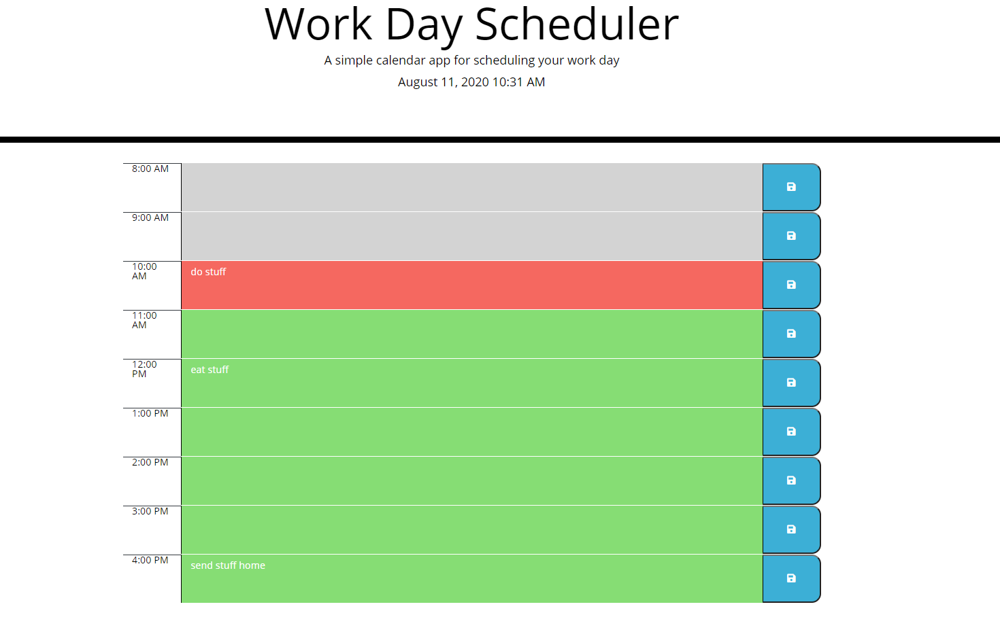

#  5 homeworkPlanner


The purpose of this homework was to create a work day planner to help plan what I need to do for the day. It includes each hour of my day and allows me to input what needs to be done then save it. If I happen to close it, it keeps a log in localstorage and everything stays as it was. It keeps track of time via moment.js and changes the style to show what hours have already come to past, the current hour I'm working in, and then my remaining hours of the day. 

## Prerequisites

```
Used Visual Studio Code and chrome's inspector tool to help build and rework code. There was a framework provided with HTML and Styling already set.
```

## Process/What was Changed

```
I added what i needed to the HTML framework that was provided, which was basically just rows/columns of divs inside my container. Then focused on getting things done, one at a time, working my way down. First was the current date. I set that using moment.js.

Next was getting the info in the boxes. So I added the time block with a funtion. Then I needed a click listener for when text was added to the <textarea> so it would save that input. Also included adding the save button. 

Once those were added, I needed to make sure the style was showing to reflect the time passing throughout the day. I used a function with if/else if statements for it. 

Lastly, was making sure local storage was working so it would save all inputs and keep them there. 

Then wrapped it up with some cleaning and organizing.

```

## Review

```
I'm finding the homework getting easier to get through. This wasn't as overwhelming and I spent less time on this than others.   

```

- - -
© 2020 Lisa Worsham Services, Inc. All Rights Reserved.